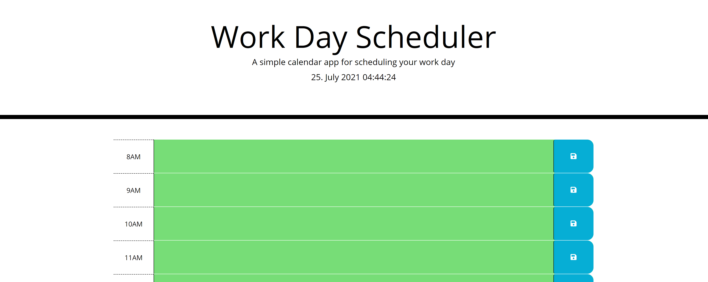

# Work Day Scheduler

## Table of Contents:

### [Description](#description-header)

### [Installation](#installation-header)

### [Usage](#usage-header)

### [Licence](#licence-header)

### [Credits](#credits-header)

### [Questions](#questions-header)

---

 

##  Description

As a means of learning local storage and jQuery, it seemed appropriate to make a work day scheduler! Local storage was used as a means of saving a user's text entry. Instead of JavaScript, the back-end code being used to power this application is jQuery.

This simple application's purpose is to create a daily work scheduler. It takes in a user's input and saves it to local storage, therefore preserving it for the next time the user logs into the webpage. It also provides a visual rubric - updated in real time - that marks out the hours in a color codes.

 

##  Installation

No installation necessary! Merely click [here](https://cperezba.github.io/Work-Day-Scheduler/) to reach the application.

 

##  Usage

To use the 'Work Day Scheduler'  merely type in the required to-do item and click on the blue "save" button on the right hand side. The application will save your entry and preserve it in memory.

---

---

To edit or delete the entry, merely clear the selection and, again, click the blue "save button on the right hand side. The entry will no longer be kept in memory.

 

##  Credits

Credit goes to the UTA Bootcamp for providing instruction and tools for learning Full-stack web development.

 

##  Licence

Work Day Scheduler is released under the MIT licence.

 

##  Questions

For more information and suggestions you can contact me at caperez317@gmail.com.

For a list of other projects and repos visit https://github.com/cperezba

---
